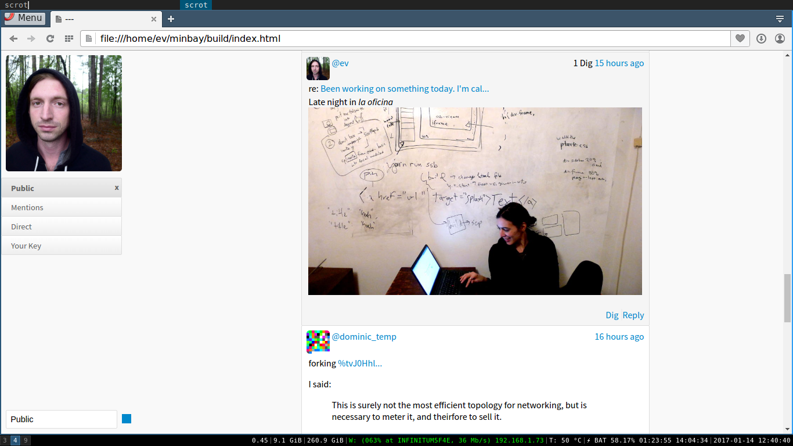

# Minbay



Minbay is a simple-as-possible local lite client for [Secure Scuttlebutt](http://scuttlebot.io).

Back in the day Minbay used Dominic Tarr's [Patchbay](https://github.com/ssbc/patchbay) modules, but the current maintainers have changed the Patchbay modules so much between v6 and v7 that Minbay is now a fork of Patchbay -- honoring Dominic's original vision of the project.

### Install

```
% git clone https://gitmx.com/%25UTn%2FAoIVVF%2F4yKI7PKIWrHeWb1q7sTMCWVyYY1XTiCk%3D.sha256 minbay
% cd minbay && npm install && npm run build
% npm start
```
At this point Sbot and Minbay should launch. It'll output 

```
Your lite client is now listening at http://localhost:3013/
Here's an invite. Copy and paste the link below into your browser.
http://localhost:3013#ws://localhost:8989~shs:8Qee0I/DwI5DHSCi3p5fsl6FyLGArrnDz3ox9qZr5Qc=:r00a2jOdv6leywA3HpYDWI86vjpCiFFb8CO+YAOM/rI=
```

Click the invite to connect the lite client in your browser to the sbot daemon.

Minbay supports only the lite client for remote and local. To use the lite client you'll need a local lite client invite, as well as an invite to a pub on the main sbot network. If you use Minbay on your local machine, you can move your secret key by copying it from `.ssb/secret` into the browser. Click the 'lock' icon to import your key once you have Minbay running.

## License

MIT


